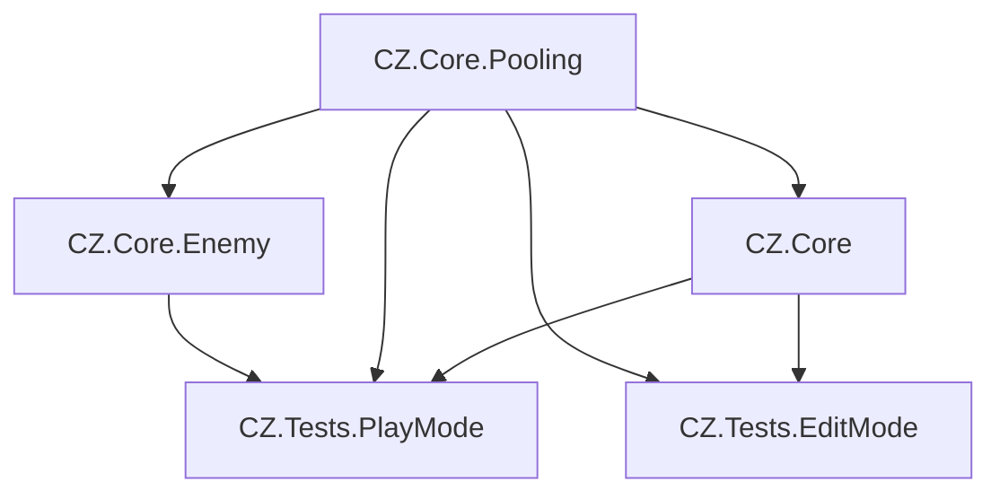

# Project Dependencies Documentation

## Assembly Structure


## Assembly Definitions

### Core Assemblies
1. **CZ.Core.Pooling**
   - Base pooling functionality
   - Dependencies:
     * Input System (GUID:75469ad4d38634e559750d17036d5f7c)
     * NaughtyAttributes (GUID:776d03a35f1b52c4a9aed9f56d7b4229)

2. **CZ.Core**
   - Core game functionality
   - Dependencies:
     * CZ.Core.Pooling
     * Input System
     * NaughtyAttributes

3. **CZ.Core.Enemy**
   - Enemy system implementation
   - Dependencies:
     * CZ.Core.Pooling
     * Input System
     * NaughtyAttributes

### Test Assemblies
1. **CZ.Tests.PlayMode**
   - Runtime/PlayMode tests
   - Dependencies:
     * UnityEngine.TestRunner
     * UnityEditor.TestRunner
     * Unity.InputSystem
     * Unity.InputSystem.TestFramework
     * CZ.Core
     * CZ.Core.Pooling
   - Test Framework: 1.4.6

2. **CZ.Tests.EditMode**
   - Editor/EditMode tests
   - Dependencies:
     * UnityEngine.TestRunner (GUID:27619889b8ba8c24980f49ee34dbb44a)
     * UnityEditor.TestRunner (GUID:0acc523941302664db1f4e527237feb3)
     * CZ.Core
     * CZ.Core.Pooling
   - Test Framework: 1.4.6

## Package Dependencies
- Universal RP: 17.0.3
- Input System: 1.13.0
- Test Framework: 1.4.6
- Timeline: 1.8.7
- Multiplayer Center: 1.0.0
- NaughtyAttributes: 2.1.4

## Testing Infrastructure
### Test Categories
1. Edit Mode Tests
   - Unit tests for core systems
   - No runtime dependencies
   - Fast execution

2. Play Mode Tests
   - Integration tests
   - Runtime behavior
   - Performance tests
   - Pool system tests

### Test Framework Setup
- NUnit for test structure
- Unity Test Runner integration
- Performance Testing Package
- Input System Test Framework

## Version Requirements
- Unity Version: 6000.0.38f1
- API Compatibility: .NET Standard 2.1
- Scripting Backend: IL2CPP

## Performance Monitoring
- ProfilerRecorder integration
- Memory tracking
- Pool utilization monitoring
- Draw call optimization

## Notes
- All assemblies must maintain proper reference hierarchy
- Avoid circular dependencies
- Test assemblies should reference only necessary assemblies
- Keep assembly references minimal for performance

Last Updated: 2024-02-16
Unity Version: 6000.0.38f1

## Development Environment
- **Unity Version**: 6.0
  - [Unity 6 Manual](https://docs.unity3d.com/6000.0/Documentation/Manual/)
  - [Unity 6 Scripting API](https://docs.unity3d.com/6000.0/Documentation/ScriptReference/)
  - [What's New in Unity 6](https://docs.unity3d.com/6000.0/Documentation/Manual/WhatsNewUnity6.html)

- **IDE**: Cursor
  - Version: 0.45.11
  - VSCode Version: 1.96.2
  - Commit: f5f18731406b73244e0558ee7716d77c8096d150
  - Date: 2025-02-07T09:43:58.555Z
  - Electron: 32.2.6
  - Chromium: 128.0.6613.186
  - Node.js: 20.18.1
  - V8: 12.8.374.38-electron.0
  - Website: https://cursor.sh/
  - Documentation: https://cursor.sh/docs/getting-started
  - GitHub: https://github.com/getcursor/cursor

## Core Unity Packages
| Package | Version | Documentation | Purpose |
|---------|---------|---------------|----------|
| Universal RP | 17.0.3 | [URP Documentation](https://docs.unity3d.com/Packages/com.unity.render-pipelines.universal@17.0/api/index.html) | Rendering pipeline |
| Input System | 1.13.0 | [Input System Manual](https://docs.unity3d.com/Packages/com.unity.inputsystem@1.13/manual/index.html) | Player input handling |
| Test Framework | 1.4.6 | [Test Framework Guide](https://docs.unity3d.com/Packages/com.unity.test-framework@1.4/manual/index.html) | Unit and integration testing |
| Timeline | 1.8.7 | [Timeline Manual](https://docs.unity3d.com/Packages/com.unity.timeline@1.8/manual/index.html) | Animation and sequencing |
| Multiplayer Center | 1.0.0 | [Netcode for GameObjects](https://docs.unity3d.com/Packages/com.unity.netcode.gameobjects@2.2/manual/index.html) | Multiplayer functionality |

## Third-Party Packages
| Package | Version | Source | Documentation | Purpose |
|---------|---------|--------|---------------|----------|
| NaughtyAttributes | 2.1.4 | [OpenUPM](https://openupm.com/packages/com.dbrizov.naughtyattributes/) | [Official Documentation](https://dbrizov.github.io/na-docs/) | Inspector enhancement |

## Project-Specific Resources
| Resource | Version/Path | Purpose |
|----------|--------------|----------|
| Core Game Loop | `/Documentation/Architecture/checklists/core_game_loop_checklist.txt` | Development roadmap |
| Performance Guidelines | `/Documentation/Guidelines/performance_guidelines.txt` | Performance targets |
| Infrastructure | `/Documentation/Guidelines/infrastructure.txt` | Project structure |
| AI Rules | `/Documentation/Guidelines/ai_rules.json` | AI assistant configuration |

## Version Control
- **Git**: Latest
- **.gitignore**: Unity template
- **Git LFS**: Required for binary assets
- **Unity Version Control**: 2.6.0 (com.unity.collab-proxy)

## Build Targets
- **Primary**: Windows Standalone
  - Windows SDK: 10.0.26100
  - Architecture: x64
- **Development**: Editor (Windows)

## Performance Targets (As per Unity 6 Guidelines)
- **FPS**: 60 ([Performance Monitoring](https://docs.unity3d.com/6000.0/Documentation/Manual/Profiler.html))
- **Max Draw Calls**: 100 ([Graphics Performance](https://docs.unity3d.com/6000.0/Documentation/Manual/OptimizingGraphicsPerformance.html))
- **Max Memory**: 1024MB ([Memory Management](https://docs.unity3d.com/6000.0/Documentation/Manual/performance-memory-management.html))
- **Target Resolution**: 1920x1080

## Package Registry Sources
```json
{
  "scopedRegistries": [
    {
      "name": "package.openupm.com",
      "url": "https://package.openupm.com",
      "scopes": [
        "com.dbrizov.naughtyattributes"
      ]
    }
  ]
}
```

## Official Unity 6 Resources
- [2D Development Guide](https://docs.unity3d.com/6000.0/Documentation/Manual/2DFeature.html)
- [Physics 2D Reference](https://docs.unity3d.com/6000.0/Documentation/Manual/Physics2DReference.html)
- [Best Practices Guide](https://docs.unity3d.com/6000.0/Documentation/Manual/BestPracticeGuides.html)
- [Performance Optimization](https://docs.unity3d.com/6000.0/Documentation/Manual/BestPracticeUnderstandingPerformanceInUnity.html)

## Version Update Process
1. Document all version changes in this file
2. Update package versions in `Packages/manifest.json`
3. Test compatibility in a development branch
4. Update relevant documentation and code
5. Create migration notes if needed

## Notes
- All documentation links are verified against Unity 6 documentation
- Package versions are verified against current project manifest
- Performance targets align with Unity 6 guidelines
- Links are maintained for offline documentation access

Last Updated: 2024-02-15 