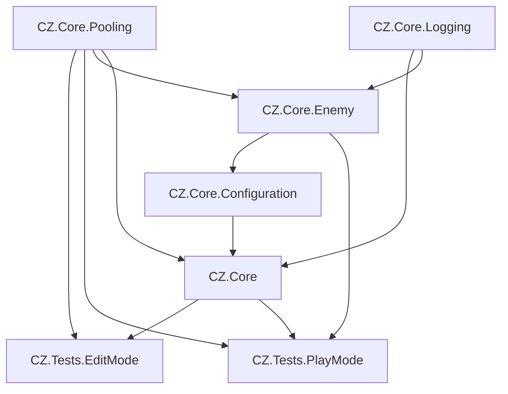

# Assembly Structure Documentation

## Overview
This document describes the assembly structure of the CZGAME project, including the dependencies between assemblies and their purpose.

## Assembly Dependency Graph


## Assembly Definitions

### Core Assemblies
1. **CZ.Core**
   - Core game functionality
   - Dependencies:
     * CZ.Core.Pooling
     * Input System
     * NaughtyAttributes

2. **CZ.Core.Pooling**
   - Base pooling functionality
   - Dependencies:
     * Input System (GUID:75469ad4d38634e559750d17036d5f7c)
     * NaughtyAttributes (GUID:776d03a35f1b52c4a9aed9f56d7b4229)

3. **CZ.Core.Enemy**
   - Enemy system implementation
   - Dependencies:
     * CZ.Core.Pooling
     * CZ.Core
     * CZ.Core.Interfaces
     * CZ.Core.Resource
     * CZ.Core.Logging
     * CZ.Core.Configuration
     * Input System
     * NaughtyAttributes

4. **CZ.Core.Configuration**
   - Configuration systems for physics, memory, etc.
   - Dependencies:
     * Input System

5. **CZ.Core.Logging**
   - Centralized logging system
   - Dependencies:
     * Unity core modules

### Test Assemblies
1. **CZ.Tests.PlayMode**
   - Runtime/PlayMode tests
   - Dependencies:
     * UnityEngine.TestRunner
     * UnityEditor.TestRunner
     * Unity.InputSystem
     * Unity.InputSystem.TestFramework
     * CZ.Core
     * CZ.Core.Pooling
   - Test Framework: 1.4.6

2. **CZ.Tests.EditMode**
   - Editor/EditMode tests
   - Dependencies:
     * UnityEngine.TestRunner (GUID:27619889b8ba8c24980f49ee34dbb44a)
     * UnityEditor.TestRunner (GUID:0acc523941302664db1f4e527237feb3)
     * CZ.Core
     * CZ.Core.Pooling
   - Test Framework: 1.4.6

## Best Practices for Assembly References

1. **Avoid Circular Dependencies**
   - Assemblies should form a directed acyclic graph
   - If two assemblies need to reference each other, consider:
     * Moving shared code to a common assembly
     * Using interfaces to decouple implementations

2. **Minimize Assembly References**
   - Only reference assemblies that are directly needed
   - Consider using interfaces for cross-assembly communication

3. **Keep Assembly Definitions Consistent**
   - Use consistent naming conventions
   - Document all assembly references
   - Update this documentation when adding new assemblies

## Common Issues and Troubleshooting

### Missing Assembly References
If you encounter errors about missing types or namespaces:

1. Check that the assembly containing the type is referenced in your assembly definition
2. Verify that the assembly definition file is properly formatted
3. Ensure the referenced assembly exists in the project

Example error:
```
error CS0246: The type or namespace name 'Physics2DSetup' could not be found
```

This typically means the assembly containing the type (e.g., CZ.Core.Configuration) is not referenced in your assembly definition.

### Recently Fixed Issues

We recently encountered and fixed an issue where `BaseEnemy` couldn't reference the `Physics2DSetup.ColliderAdjustmentMarker` due to a missing assembly reference. This was resolved by adding `CZ.Core.Configuration` to the references in `CZ.Core.Enemy.asmdef`.

## Unity 6 Assembly Definition Best Practices

1. **Explicit Dependencies**
   - Always list all direct dependencies explicitly
   - Using GUIDs for Unity packages is recommended for stability

2. **Versioning**
   - Keep track of version requirements for external packages
   - Document compatibility requirements

3. **Documentation**
   - Document the purpose of each assembly
   - Keep this assembly structure documentation updated

Last Updated: 2025-02-27
Unity Version: 6000.0.38f1 