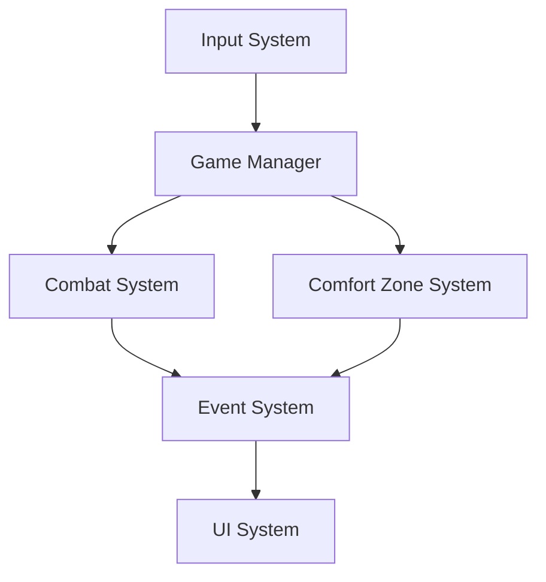

# Project Infrastructure Plan

## 1. Development Environment Setup

### Required Software
- Unity 6000.0.38f1 (Unity 6)
- Visual Studio 2022/Rider 2023
- Git + Git LFS
- Unity Package Manager dependencies:
  - Universal RP 17.0.3
  - Input System 1.13.0
  - Test Framework 1.4.6
  - Timeline 1.8.7
  - Multiplayer Center 1.0.0
  - NaughtyAttributes 2.1.4 (via OpenUPM)

### Project Configuration

```json
{
    "unity": {
        "version": "6000.0.38f1",
        "targetPlatforms": ["Windows", "MacOS", "Linux"],
        "scriptingBackend": "IL2CPP",
        "apiCompatibility": ".NET Standard 2.1",
        "renderPipeline": "Universal RP 17.0.3"
    },
    "versionControl": {
        "git": true,
        "lfs": true,
        "branchingStrategy": "gitflow",
        "unityVersionControl": "2.6.0"
    }
}
```

## 2. Project Architecture

### Core Systems Hierarchy

```
GameManager
├── SceneManager
├── ResourceManager
├── EventManager
├── InputManager
├── UIManager
├── AudioManager
└── SaveManager

ComfortZoneSystem
├── ZoneManager
├── AIAwarenessSystem
└── ResourceDenialSystem

CombatSystem
├── WeaponManager
├── ProjectileManager
└── DamageManager
```

### Data Flow Architecture



## 3. Code Organization

### Folder Structure

```
Assets/
├── _Project/
│   ├── Scripts/
│   │   ├── Core/
│   │   ├── Combat/
│   │   ├── ComfortZone/
│   │   ├── UI/
│   │   └── Utils/
│   ├── Prefabs/
│   │   ├── Core/
│   │   ├── Combat/
│   │   ├── Zones/
│   │   └── UI/
│   ├── ScriptableObjects/
│   │   ├── Weapons/
│   │   ├── Enemies/
│   │   └── Zones/
│   └── Scenes/
└── Tests/
    ├── EditMode/
    └── PlayMode/
```

### Editor Integration Guidelines

```csharp
// NaughtyAttributes Button Integration Pattern
public class EditorButtonPattern : MonoBehaviour
{
    [Button("Action Name")]
    public void EditorAction()
    {
        // 1. Check if in editor and not playing
        #if UNITY_EDITOR
        if (!UnityEditor.EditorApplication.isPlaying)
        {
            Debug.Log("Starting play mode from editor...");
            UnityEditor.EditorApplication.isPlaying = true;
            return;
        }
        #endif

        // 2. Perform validation
        if (!ValidateRequirements())
        {
            Debug.LogError("Validation failed");
            return;
        }

        // 3. Direct state changes instead of coroutines
        SetNewState();
    }
}
```

### NaughtyAttributes Best Practices

1. **Editor vs Play Mode Handling**:
   - Always check EditorApplication.isPlaying when using [Button]
   - Handle editor-to-play transitions explicitly
   - Avoid coroutines in direct button callbacks
   - Use state management instead of coroutine sequences

2. **State Management Pattern**:
```csharp
private void SetGameState(GameState newState)
{
    try
    {
        // Pre-transition setup
        PreTransitionSetup(newState);

        // Update state
        UpdateState(newState);

        // Post-transition setup
        PostTransitionSetup(newState);
    }
    catch (Exception e)
    {
        HandleTransitionError(e);
    }
}
```

3. **System Validation**:
   - Validate before state changes
   - Use explicit validation methods
   - Handle editor-specific initialization
   - Maintain proper cleanup

4. **Common Pitfalls**:
   - Avoid yield returns in [Button] methods
   - Don't assume play mode state in button callbacks
   - Handle editor-to-play transitions properly
   - Consider editor script execution context

## 4. Performance Infrastructure

### Monitoring System

```csharp
public class PerformanceInfrastructure : MonoBehaviour
{
    public static class Thresholds
    {
        // Memory Thresholds
        public const float BASE_MEMORY_MB = 1024f;
        public const float WARNING_MEMORY_MB = 1536f;
        public const float CRITICAL_MEMORY_MB = 1792f;
        public const float EMERGENCY_MEMORY_MB = 2048f;

        // Pool Memory Thresholds
        public const float POOL_WARNING_MB = 256f;
        public const float POOL_CRITICAL_MB = 358.40f;
        public const float POOL_EMERGENCY_MB = 460.80f;

        // Performance Thresholds
        public const int MAX_DRAW_CALLS = 100;
        public const int TARGET_FPS = 60;
        public const int MAX_ENTITIES = 200;
        public const int MAX_PARTICLES = 1000;
    }

    public static class PoolSizes
    {
        // Initial Pool Sizes
        public const int PROJECTILES_INITIAL = 100;
        public const int ENEMIES_INITIAL = 50;
        public const int VFX_INITIAL = 25;
        public const int UI_INITIAL = 50;

        // Maximum Pool Sizes
        public const int PROJECTILES_MAX = 200;
        public const int ENEMIES_MAX = 100;
        public const int VFX_MAX = 50;
        public const int UI_MAX = 100;
    }

    public static class Intervals
    {
        public const float ZONE_UPDATE = 0.1f;
        public const float AI_UPDATE = 0.2f;
        public const float POOL_CLEANUP = 1.0f;
        public const float PERFORMANCE_CHECK = 0.5f;
        public const float MEMORY_UPDATE = 0.5f;
    }

    private ProfilerRecorder drawCallsRecorder;
    private ProfilerRecorder memoryRecorder;
    private ProfilerRecorder gcMemoryRecorder;
    private ProfilerRecorder systemMemoryRecorder;

    private void OnEnable()
    {
        drawCallsRecorder = ProfilerRecorder.StartNew(ProfilerCategory.Render, "Draw Calls Count");
        memoryRecorder = ProfilerRecorder.StartNew(ProfilerCategory.Memory, "Total Used Memory");
        gcMemoryRecorder = ProfilerRecorder.StartNew(ProfilerCategory.Memory, "GC Reserved Memory");
        systemMemoryRecorder = ProfilerRecorder.StartNew(ProfilerCategory.Memory, "System Used Memory");
    }

    private void OnDisable()
    {
        drawCallsRecorder.Dispose();
        memoryRecorder.Dispose();
        gcMemoryRecorder.Dispose();
        systemMemoryRecorder.Dispose();
    }
}
```

### Object Pooling Infrastructure

```csharp
public class PoolManager : MonoBehaviour
{
    private Dictionary<string, ObjectPool<PoolableObject>> pools;
    
    public void InitializePools()
    {
        pools = new Dictionary<string, ObjectPool<PoolableObject>>
        {
            {"projectiles", new ObjectPool<PoolableObject>(
                initialSize: PoolSizes.PROJECTILES_INITIAL,
                maxSize: PoolSizes.PROJECTILES_MAX,
                memoryBudgetMB: 10f)},
            {"enemies", new ObjectPool<PoolableObject>(
                initialSize: PoolSizes.ENEMIES_INITIAL,
                maxSize: PoolSizes.ENEMIES_MAX,
                memoryBudgetMB: 10f)},
            {"vfx", new ObjectPool<PoolableObject>(
                initialSize: PoolSizes.VFX_INITIAL,
                maxSize: PoolSizes.VFX_MAX,
                memoryBudgetMB: 10f)},
            {"ui", new ObjectPool<PoolableObject>(
                initialSize: PoolSizes.UI_INITIAL,
                maxSize: PoolSizes.UI_MAX,
                memoryBudgetMB: 5f)}
        };
    }
}
```

## 5. Testing Infrastructure

### Test Categories
- Unit Tests (Edit Mode)
- Integration Tests (Play Mode)
- Performance Tests (using Unity Performance Testing Package)
- UI Tests
- Network Tests (using Unity Multiplayer Tools)

### Test Framework Setup

```csharp
using NUnit.Framework;
using UnityEngine.TestTools;
using Unity.PerformanceTesting;

[TestFixture]
public class PerformanceTests
{
    [Test, Performance]
    public void ObjectPool_Stress_Test()
    {
        Measure.Method(() =>
        {
            // Test pool performance under load
        })
        .WarmupCount(3)
        .MeasurementCount(10)
        .Run();
    }

    [UnityTest, Performance]
    public IEnumerator ComfortZone_Entity_Check_Performance()
    {
        using (Measure.Frames()
            .WarmupCount(10)
            .MeasurementCount(50))
        {
            // Test zone calculations with max entities
            yield return null;
        }
    }
}
```

## 6. Build Pipeline

### Development Workflow
1. Local Development
2. Feature Branch Testing
3. Integration Testing
4. Performance Testing
5. Release Candidate
6. Production Build

### Automated Build Process

```yaml
build_pipeline:
  stages:
    - compile
    - test
    - build
    - deploy

  settings:
    unity_version: "6000.0.38f1"
    build_targets:
      - Windows64
      - MacOS
      - Linux
    performance_targets:
      max_draw_calls: 100
      target_fps: 60
      base_memory_mb: 1024
      warning_memory_mb: 1536
      critical_memory_mb: 1792
      emergency_memory_mb: 2048
      pool_warning_mb: 256
      pool_critical_mb: 358.40
      pool_emergency_mb: 460.80
```

## Related Documentation

- [Performance Guidelines](../Performance/PerformanceGuidelines.md)
- [Object Pooling](../Systems/ObjectPooling.md)
- [Physics System](../Systems/Physics.md)

## Revision History

| Date | Version | Changes |
|------|---------|---------|
| 2025-02-27 | 1.0 | Initial document creation |

Last Updated: 2025-02-27
Unity Version: 6000.0.38f1 